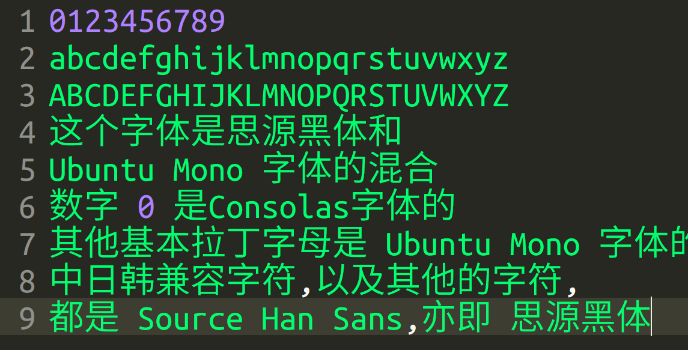
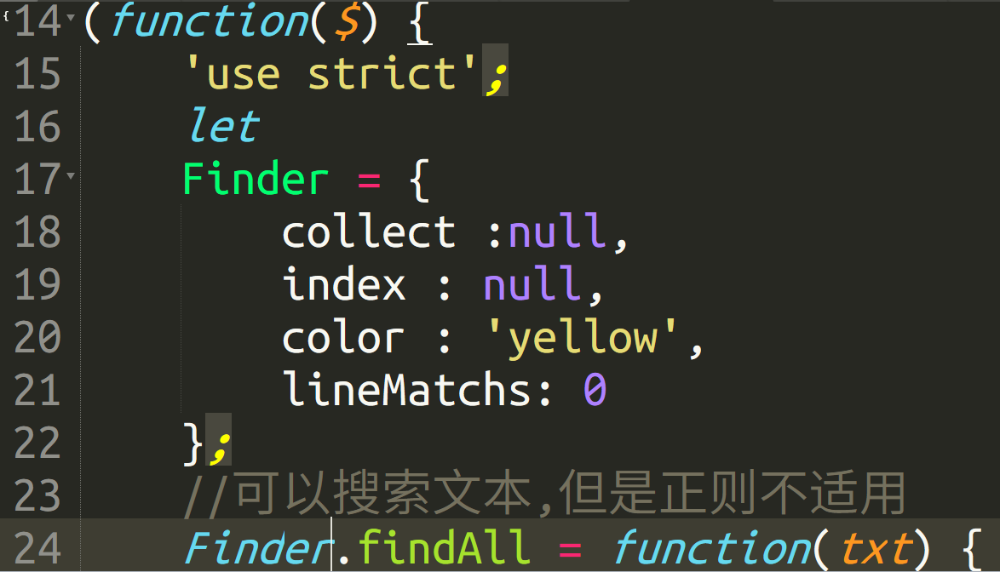
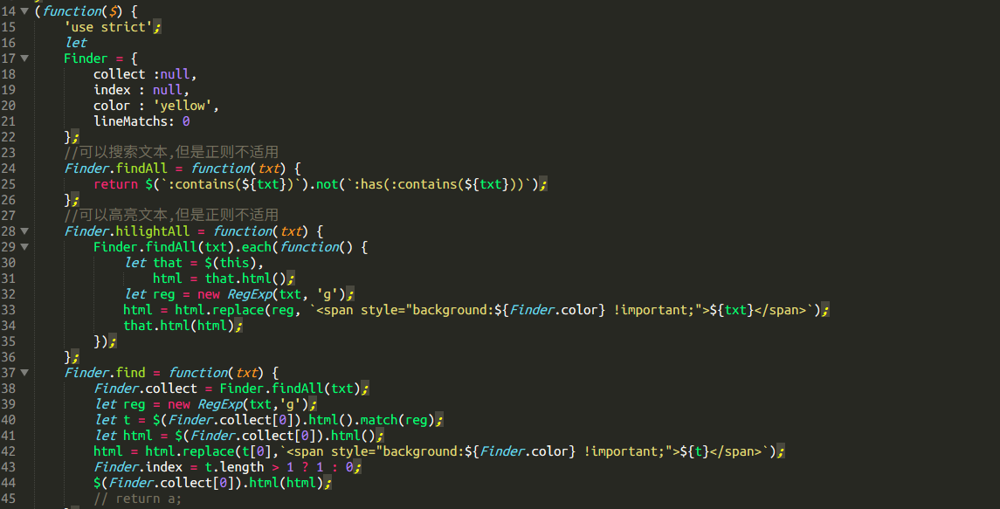
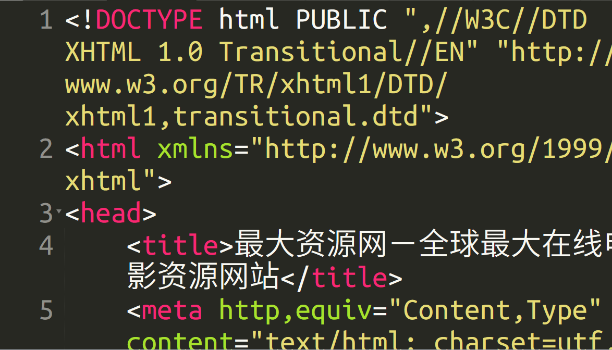
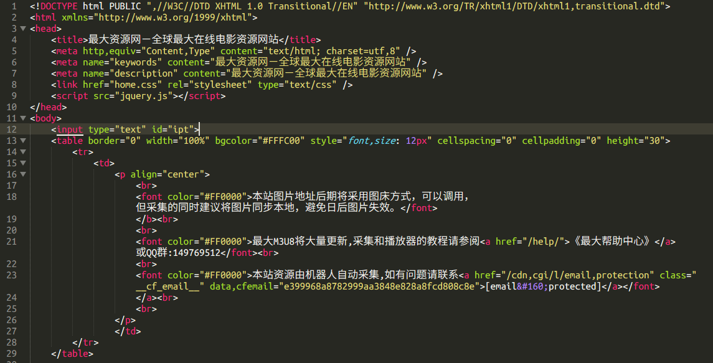
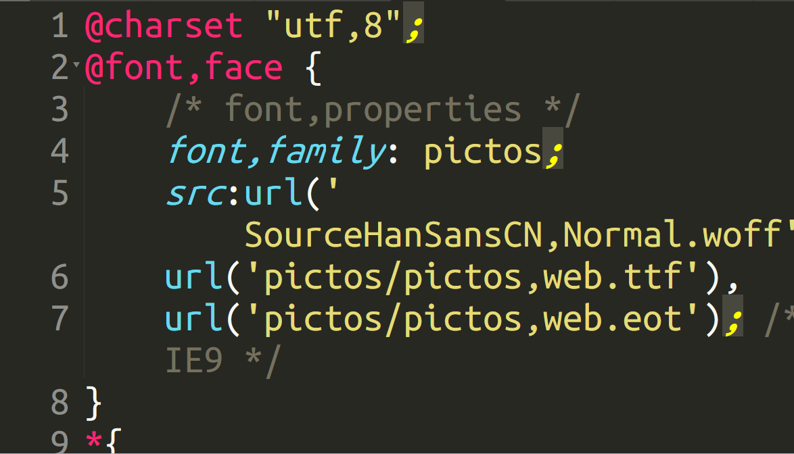
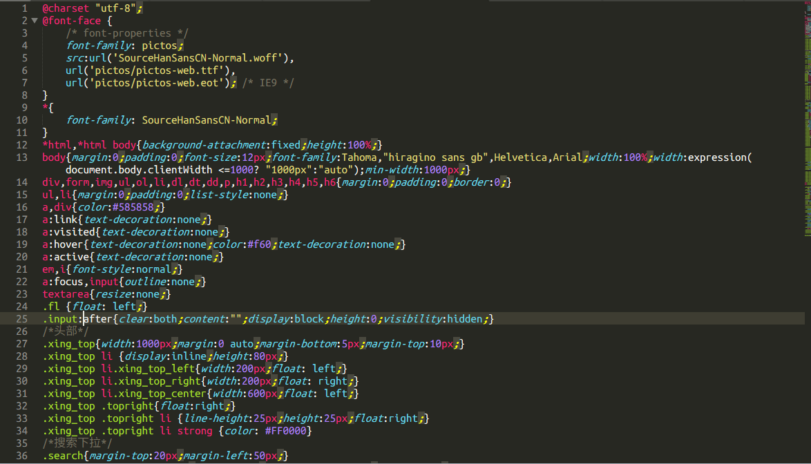

# MoveIt
------

### Text:
<pre style="font-size:16px;">
0123456789
abcdefghijklmnopqrstuvwxyz
ABCDEFGHIJKLMNOPQRSTUVWXYZ
这个字体是思源黑体和
Ubuntu Mono 字体的混合
数字 0 是Consolas字体的
其他基本拉丁字母是 Ubuntu Mono 字体的
中日韩兼容字符,以及其他的字符,
都是 Source Han Sans,亦即 思源黑体
</pre>

### In Sublime Text 3:

### Code in Sublime Text 3:
##### Javascript Big

##### Javascript

##### HTML Big

##### HTML

##### CSS Big

##### CSS
